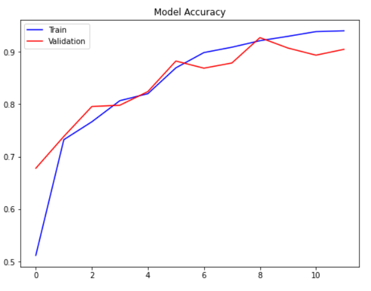

# Covid X-Ray Image Classification
Classify X-ray images into three classes: Covid, Normal, and Viral Pneumonia using CNN model based on VGG-16 model. Given 3,616 COVID-19 positive cases along with 10,192 Normal, and 1345 Viral Pneumonia images, only 1,345 cases were sampled to balance target distribution.

# Objective
This project is to learn applying deep learning using a CNN model to multiclass classification.

# Summary
- Train and validation loss decreased during training. For the highest validation accuracy of 92.69%, train accuracy was and 92.10% The model still has high bias and can be improved by training with more data, training longer, or improving the neuron network.

  
- From the classification report, `Covid` and `Normal` cases has almost the same f1-score at about 90%. Meanwhile, `Viral Pneumonia` case has f1-score at 97%
                                   
- The confusion matrix showed that the model classified well on Viral Pneumonia cases in accordance with classification report. There were still many normal cases were mistaken to COVID cases or vice versa.

# Licenses / Acknowledgements / References
Data Resource: https://www.kaggle.com/tawsifurrahman/covid19-radiography-database/code
References:
1) 
2) 
